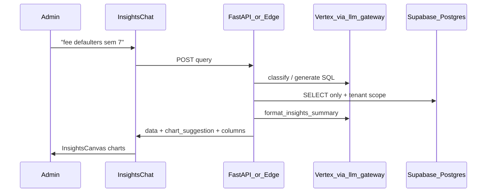

# Conversational ERP Insights (Ami) — Implementation Plan

## Engineering spec (Antigravity) — CTO review

**Verdict: Approved with modifications.** Aligns with ADR-001–004. Safe for your dev team to execute as the primary implementation doc. Corrections below are binding; do not treat Antigravity’s doc as verbatim without this section.

| Antigravity item | Status | CTO note |
|------------------|--------|----------|
| Single FastAPI orchestrator | Approve | Matches consolidation strategy |
| `insights_orchestrator.py` 5 phases | Approve | Intent → resolver → safety → viz → envelope |
| Deprecate Edge `insights-query` | Approve | Remove edge-first in `api.js`; archive function, don’t delete until Phase 1 sign-off |
| 3-tier viz binder | Approve | Use **50 rows** for operational list → `table` (Antigravity); keep **500** cap for forced table on any chart |
| Remove `adminAmiAPI` entirely | **Modify** | Remove only `adminAmiAPI.query` from UI; **keep** `context-map` + `action-preview` until Phase 3 or fold into orchestrator |
| `SecurityHardeningError` on DML block | **Modify** | DML blocks should raise **`ValueError`** / HTTP 400 with “Blocked keyword” (existing pattern). Reserve `SecurityHardeningError` for admin-engine misuse ([`database.py`](backend/database.py)) |
| 5s `statement_timeout` on all queries | **Modify** | Main path today uses **45s** on isolated session ([`insights_executor.py`](backend/app/services/insights_executor.py) L932). Use **tiered**: MV reads **8s**, generated SQL **30s**, domain introspection **3s** (already). Blanket 5s will break Pro-tier JOINs and pins |
| `InsightsCanvas` JSX → TSX | **Skip Phase 1** | Already [`.tsx`](frontend/src/components/insights/InsightsCanvas.tsx); only add strict props types if touching file |
| Intent router “check cache first” | Approve | Reuse Redis SQL-keyed cache in router before LLM classify |
| `tests/test_insights_orchestration.py` | Approve | Add to Phase 1 DoD |

### Decisions on open questions (founder defaults — override if needed)

**Daily rate limit:** **50 queries/user/day** as platform default (already mirrored in [`llm_gateway.py`](backend/app/services/llm_gateway.py) `MAX_REQUESTS_PER_USER_PER_DAY`). Make **tenant-configurable** via `colleges` settings JSON or feature flag (`insights_daily_limit`) for enterprise deals — do not hardcode only in env.

**Golden query baseline:** Yes — baseline **tenant-agnostic rules** from live DB introspection (grade points, attendance statuses, batches), plus **5–10 tenant-specific** cases only if a pilot college has custom formulas. Initial golden set (CI):

1. Students with attendance below 50% → table, `attendance_pct` filter  
2. Fee defaulters in semester 7 → table, `current_semester = 7`  
3. Fee collection by department → bar_chart  
4. Paid vs unpaid fees (college-wide aggregate) → pie_chart or kpi_card  
5. Pass rate by department and batch → grouped_bar  
6. `DROP TABLE` injection → blocked (400, not `SecurityHardeningError`)  
7. HOD query without department scope on base tables → blocked or auto-filtered  
8. Vague query → guided prompts, empty data  
9. Pin replay via `cached_sql` → same row count ±0  
10. Row count &gt; 50 with `student_name` in columns → `chart_suggestion` forced to `table`

Add mentor/TPO/proctor filters in Phase 2 when those modules have stable `v_*` views.

---

# Conversational ERP Insights (Ami) — Implementation Plan

## Recommendation (your orchestrator question)

**Use the FastAPI backend as the single source of truth** for admin conversational ERP, not the Supabase Edge Function as primary.

| Criterion | FastAPI (`/insights/query`) | Edge (`insights-query`) |
|-----------|----------------------------|-------------------------|
| Auth / tenant | JWT + `TenantMiddleware` + RLS session | Manual `college_id` in body |
| Chart contract | Full: `x_column`, `y_column`, `group_column`, `grouped_bar`, `kpi_card` | Thin: `chart_suggestion` only |
| SQL safety | [`insights_executor.py`](backend/app/services/insights_executor.py) + role-scoped `v_*` temp views | `insights_execute_safe` RPC |
| Pins / audit | [`pinned_insights`](backend/app/models/core.py) + router | No pin support |
| MV fast path | **Missing today** | **Already built** |

**Pragmatic rollout:** Port the Edge Function’s MV classifier/registry into the backend first, then switch [`frontend/src/services/api.js`](frontend/src/services/api.js) `insightsAPI.query` to call **Python only** (remove edge-first fallback). Keep the Edge Function only if you later need geographic edge latency; do not maintain two LLM prompt stacks long term.

---

## What you already have (do not rebuild)



**Working today:**
- UI: [`InsightsChat.tsx`](frontend/src/components/insights/InsightsChat.tsx) + [`InsightsCanvas.tsx`](frontend/src/components/insights/InsightsCanvas.tsx) + [`InsightsChart.tsx`](frontend/src/components/insights/InsightsChart.tsx) on Admin, HOD, Exam Cell, TPO dashboards
- Backend pipeline: [`insights.py`](backend/app/routers/insights.py) → `generate_insights_sql` → `execute_insights_query` → `format_insights_summary` in [`ai_service.py`](backend/app/services/ai_service.py)
- Vertex routing: [`llm_gateway.py`](backend/app/services/llm_gateway.py) (`erp_insights` / `erp_complex` / `erp_summary`)
- Edge prototype: [`insights-query/index.ts`](insights-query/index.ts) with MV registry + 3-tier classifier (KNOWN / SIMPLE / COMPLEX / VAGUE)

**Not production-ready yet:**
- [`admin_ami_service.py`](backend/app/services/admin_ami_service.py) is a **keyword stub** (no SQL, empty `charts`) — separate from real Insights
- Frontend prefers Edge first → admins often get **weaker charts** (no axis binding)
- Backend lacks **MV fast path** (Edge has it; Python always text-to-SQL)
- Finance/HR modules are new in git status; ensure schema + `v_*` views cover fee defaulters

---

## Target architecture

Treat conversational ERP as a **read-only analytics agent** with a fixed response envelope (already in [`InsightsQueryResponse`](backend/app/schemas/insights.py)):

```json
{
  "summary": "...",
  "data": [...],
  "columns": [...],
  "chart_suggestion": "grouped_bar",
  "x_column": "department",
  "y_column": "unpaid_amount",
  "group_column": null,
  "all_metrics": ["unpaid_amount", "unpaid_count"],
  "generated_sql": "SELECT ..."
}
```

### Pipeline stages (single service module)

Create **`app/services/insights_orchestrator.py`** (name flexible) with explicit stages:

1. **Intent router** (small LLM call, temp 0)
   - Labels: `KNOWN_MV` | `GENERATE_SQL` | `VAGUE` | (later) `ACTION_PREVIEW`
   - Port registry from [`insights-query/index.ts`](insights-query/index.ts) `MV_REGISTRY` + examples like `attendance_student|filter:attendance_pct < 50`
   - Map admin phrases: "7th semester" → `current_semester = 7`, "defaulters" → unpaid invoice pattern

2. **Data resolver**
   - `KNOWN_MV`: query `mv_*` view with college filter + parsed filters (same logic as Edge lines 243–268)
   - `GENERATE_SQL`: existing `generate_insights_sql` + `gateway.complete_erp` tiering
   - `VAGUE`: return suggested prompts (reuse Edge vague handler copy)

3. **Secure executor** (unchanged core)
   - Keep [`execute_insights_query`](backend/app/services/insights_executor.py): SELECT-only regex, role-scoped `v_*` views, HOD department enforcement, Redis cache keyed on SQL hash ([`insights.py`](backend/app/routers/insights.py) L33–41)

4. **Viz binder** (hybrid — this answers “platform suggests chart type”)
   - **Step A — deterministic shape rules** (fast, testable):
     - 1 row, 1–3 metrics → `kpi_card`
     - 2–5 categories + one metric + “share/split/distribution” in question → `pie_chart`
     - time-like x (`semester`, `month`, `date`) → `line_chart` / `multi_line`
     - 2 string dims + numeric → `grouped_bar` (high-cardinality string → `x_column`, low → `group_column`)
     - student lists / defaulter rosters (>50 rows, name columns) → default `table`, optional bar by department if aggregated
   - **Step B — LLM refinement** via existing `format_insights_summary` (already injects **column cardinality** — critical rule at L751–755 in `ai_service.py`)
   - **Step C — rule override**: if row_count > 500 and query is row-level detail → force `table` regardless of LLM

5. **Response + observability**
   - Log: `intent`, `source` (`mv:attendance_student` vs `sql:flash`), `timing_ms`, `row_count` (no PII in logs)
   - Always return `generated_sql` (or `mv_key`) for pin/replay

[`insights.py`](backend/app/routers/insights.py) becomes a thin wrapper calling the orchestrator.

---

## Example query mapping

| Admin question | Router | Data source | Default viz |
|----------------|--------|-------------|-------------|
| Attendance below 50% | `KNOWN_MV:attendance_student` + `attendance_pct < 50` | `mv_student_attendance` | `table` if many students; `bar_chart` if grouped by dept |
| Fee defaulters 7th semester | `GENERATE_SQL` (complex) | Join `user_profiles` + unpaid `student_fee_invoices` / payments | `table` (action list); `bar_chart` by department if aggregated |
| Fee collection by department | `KNOWN_MV:fee_collection_dept` | materialized view | `bar_chart` |
| Compare CSE vs IT pass rate | `GENERATE_SQL` → Tier 2 Pro | `v_semester_grades` + batch in GROUP BY | `grouped_bar` |

Ensure **batch/semester scoping** stays mandatory (already enforced in `generate_insights_sql` constraints L479–493).

---

## Frontend changes (small)

1. [`api.js`](frontend/src/services/api.js): `insightsAPI.query` → **only** `api.post('/insights/query')` (drop edge-first or gate behind `VITE_INSIGHTS_USE_EDGE=false`).
2. **Unify Admin Ami**: Command Center “Ask Admin Ami” ([`AdminDashboard.tsx`](frontend/src/pages/AdminDashboard.tsx) L141–175) should call **`insightsAPI.query`**, not [`adminAmiAPI`](frontend/src/services/api.js) — one chat UX, real data.
3. [`InsightsCanvas.tsx`](frontend/src/components/insights/InsightsCanvas.tsx): already defaults view from `chart_suggestion` (L8); no change if backend always sends axis columns.
4. Optional: admin quick prompts — “Attendance &lt; 50%”, “Sem 7 fee defaulters”, “Unpaid by department”.

---

## Supabase / Postgres layer

You host on **Supabase Postgres** ([`database.py`](backend/database.py) pooler notes) — keep using it, but centralize logic in FastAPI:

1. **Materialized views** — maintain `mv_*` set from Edge registry; refresh with `pg_cron` (nightly + on-demand after bulk imports).
2. **`insights_execute_safe`** — keep as optional path inside executor for raw SQL if you prefer RPC over direct session (today backend executes in-app).
3. **RLS** — continue `college_id` isolation; MVs must include `college_id` column for filtering.
4. **Expand schema context** for new ERP modules (finance cashier, HR payroll from recent migrations) in:
   - MV registry (pre-aggregated dashboards)
   - `SCHEMA_CONTEXT` / `get_full_database_schema` introspection

Read [`supabase-postgres-best-practices`](file:///C:/Users/akank/.cursor/plugins/cache/cursor-public/supabase/release_v0.1.4/skills/supabase-postgres-best-practices/SKILL.md) when adding indexes on MV source tables (`attendance_records(student_id, date)`, fee invoice `(student_id, academic_year)`).

---

## Vertex AI / Model Garden usage

Align with existing gateway purposes (do not add ad-hoc SDK calls):

| Stage | `llm_gateway` purpose | Model tier |
|-------|----------------------|------------|
| Intent / MV classify | New `erp_classify` or reuse `erp_insights` @ temp 0 | Flash Lite |
| SQL generation | `complete_erp` → `erp_insights` / `erp_complex` | Flash → Pro |
| Semantic SQL check | existing `validate_insights_semantics` | Flash |
| Summary + chart JSON | `erp_summary` @ `json_mode=True` | Flash Lite |
| SQL repair on PG error | self-heal loop in `insights.py` | same as generation |

Add **per-tenant rate limits** (extend gateway daily caps) for admin roles to control cost.

---

## Security & compliance (non-negotiable)

- **Read-only**: no INSERT/UPDATE/DELETE in insights path; mutations only via separate “action preview” flow ([`admin_ami_service.preview_action`](backend/app/services/admin_ami_service.py)) with human confirm.
- **RBAC**: keep allowed roles in [`insights.py`](backend/app/routers/insights.py) L51; add `CASHIER` / `FINANCE_OFFICER` when those dashboards ship.
- **Never expose** `college_id`, internal ids in SELECT lists (Edge `HIDDEN_COLUMNS` pattern — mirror in executor sanitization).
- **Audit**: log query text + SQL hash + role + row_count (not full result sets).

---

## Phased delivery

### Phase 1 — Consolidate (highest ROI)
- Add `insights_orchestrator.py` with MV fast path (port from Edge)
- Wire router to orchestrator; switch frontend to Python-only
- Redirect Admin Command Center Ami box to Insights pipeline

### Phase 2 — Admin query coverage
- Add MVs / `v_*` views for: fee defaulters by semester, attendance thresholds, payroll summaries (as modules stabilize)
- Expand classifier examples for finance + attendance wording
- Golden-query test suite: 20–30 NL questions → expected SQL shape + chart type

### Phase 3 — Product polish
- Conversation memory: pass `session_history` into classifier (already accepted in schema)
- Pinned dashboards on Admin home (reuse pins UI)
- Phase 2 actions: “preview fee reminder list” executes **same SQL** as analytics, then drafts notice (no blind LLM writes)

---

## CTO brief (for founders + engineering leads)

Execution contract for developers. Technical sections above are the spec; this section covers product, risk, and sequencing.

### Strategic positioning

- **Wedge:** Colleges buy ERP for compliance; they renew for decisions. Conversational analytics turns tenant data into ask-and-act moments (attendance risk, fee leakage, placement gaps) without a BI team.
- **Do not market as generic ChatGPT.** Market **Ami — operational intelligence on live ERP data** with auditability (SQL replay, pins, role scope).
- **Moat is not the LLM.** Moat = tenant schema + business rules (batch scoping, grade points, attendance semantics) + materialized views + RBAC. Model Garden is swappable infrastructure.

### Product principles

1. **Table is truth, chart is a lens** — Every answer ships rows + export; charts are suggested defaults.
2. **Correctness over cleverness** — A boring table of 200 defaulters beats a wrong pie chart. Force `table` for row-level operational lists.
3. **Scope answers to role** — HOD = department; admin = college; nodal = selected college. Wrong scope destroys trust.
4. **Vague questions get guided prompts** — Never hallucinate a dashboard for open-ended complaints.
5. **Actions are previews, not autopilot** — SQL-backed list, human confirms, separate write API later.

### Definition of done

**Phase 1:** Single API path; Admin Command Center uses Insights pipeline (no keyword stub in user path); p95 MV &lt; 3s, SQL &lt; 15s; 15 golden queries pass in CI.

**Phase 2:** Live demo on one tenant: attendance &lt; 50%, sem 7 fee defaulters, fee by dept, pass rate by dept+batch; MV refresh documented; per-tenant rate limits.

**Phase 3:** Pin re-run via `cached_sql` always works; action preview reuses same query result as analytics.

### Team ownership

| Workstream | Owner | Primary artifacts |
|------------|-------|-------------------|
| Orchestrator + MV port | Backend lead | `insights_orchestrator.py`, Edge registry port |
| SQL safety + RLS | Backend / security | `insights_executor.py`, RLS |
| Schema + MVs | Backend + DBA | migrations, `pg_cron` |
| Viz + chat UI | Frontend | `InsightsChart`, `InsightsCanvas`, Admin wiring |
| Prompts + cost | Backend | `ai_service.py`, `llm_gateway.py` |
| Golden queries | QA / backend | `test_insights_*.py` |

One tech lead owns orchestrator end-to-end. No parallel Edge vs Python teams.

### Cost model (Vertex)

~4–6 LLM calls per question (classify + SQL + optional validate/repair + summary). Budget **~$0.02–0.15/question** depending on Pro usage.

Levers: MV fast path for top admin questions, per-user daily caps, Redis SQL cache (5 min TTL already). No multi-agent or streaming until usage is proven.

### Risk register

| Risk | Mitigation |
|------|------------|
| Dual pipeline drift | Phase 1 Python-only; freeze Edge |
| Unsafe SQL | SELECT-only, RLS, role views, semantic validator, row limits |
| Wrong batch/semester aggregates | DB-discovered domain values + mandatory batch GROUP BY |
| Wrong chart misleads admin | Rules override LLM; optional SQL debug for principals |
| 16-module sprawl | Supported question catalog per module; MV registry grows incrementally |
| DB pool pressure | MVs reduce ad-hoc JOINs; monitor p95 |

### Pilot college messaging

**Say:** Ask operational questions in English; get exportable tables and suggested charts from live data. Pin recurring views.

**Do not say:** Ask anything about your institution (until VAGUE + catalog ship).

Provide 10 canned questions per role for onboarding; track retries as failure signal.

### Metrics (first 4 weeks)

- Queries per tenant/week; % MV vs SQL; SQL repair rate; p50/p95 latency
- Pin rate; zero-row rate; chart-to-table switches (wrong chart signal)

### Sequencing (2–4 devs)

- **Weeks 1–2:** Phase 1 consolidation only
- **Weeks 3–4:** Phase 2 MVs + golden tests + sales demo script
- **Week 5+:** Phase 3 pins + action previews

Defer: NL writes, cross-tenant analytics, document RAG, new chart types.

### ADRs (record these decisions)

- **ADR-001:** FastAPI orchestrates; Supabase = DB + optional RPC
- **ADR-002:** Chart = rules, then LLM, then hard overrides
- **ADR-003:** MVs for frequent questions; text-to-SQL for long tail
- **ADR-004:** One brand — Ami Insights; retire keyword Admin Ami UI

---

## Dev handoff: file-level checklist (Antigravity)

### Backend

| Action | File |
|--------|------|
| NEW | [`backend/app/services/insights_orchestrator.py`](backend/app/services/insights_orchestrator.py) — 5 phases, MV registry port from [`insights-query/index.ts`](insights-query/index.ts) |
| MODIFY | [`backend/app/routers/insights.py`](backend/app/routers/insights.py) — thin wrapper only |
| MODIFY | [`backend/app/services/insights_executor.py`](backend/app/services/insights_executor.py) — tiered `statement_timeout`, row LIMIT enforcement |
| MODIFY | [`backend/app/services/ai_service.py`](backend/app/services/ai_service.py) — prompts stay here; orchestrator calls, no duplicate SCHEMA strings |
| MODIFY | [`backend/app/services/llm_gateway.py`](backend/app/services/llm_gateway.py) — optional `erp_classify` route; tenant limit from college settings |
| DEPRECATE | [`backend/app/services/admin_ami_service.py`](backend/app/services/admin_ami_service.py) `answer_query` keyword path — keep `preview_action` / `get_context_map` |
| NEW | [`backend/tests/test_insights_orchestration.py`](backend/tests/test_insights_orchestration.py) |

### Frontend

| Action | File |
|--------|------|
| MODIFY | [`frontend/src/services/api.js`](frontend/src/services/api.js) — `insightsAPI.query` → `/insights/query` only; strip Edge + `queryEdgeFunction` |
| MODIFY | [`frontend/src/pages/AdminDashboard.tsx`](frontend/src/pages/AdminDashboard.tsx) — Command Center ask box → `insightsAPI.query` + `session_history`; keep `contextMap` for module grid |
| OPTIONAL | [`frontend/src/components/insights/InsightsCanvas.tsx`](frontend/src/components/insights/InsightsCanvas.tsx) — error boundary fallback to table (Phase 1 if quick) |

### Verification (Antigravity + CTO)

**Automated:**

```powershell
cd backend
python -m pytest tests/test_insights_orchestration.py -v --tb=short
```

**Manual (pilot tenant):** `aits.localhost:3000` → Admin → Insights (or Command Center after wire-up):

- *"Show me students with attendance below 50%"* → table, columns include `student_name`, `attendance_pct`
- *"Compare average fee collection by department"* → default `bar_chart`
- *"Paid vs unpaid fees overall"* → `pie_chart` or `kpi_card` (aggregate only)

**Sign-off gate:** All three manual cases pass on **Python path only** (Edge disabled in `api.js`).

---

## What NOT to do

- Do not build a separate “admin AI” stack parallel to Insights — merge into one orchestrator.
- Do not let the LLM pick chart type without **column metadata** (cardinality + types) — your backend already does this correctly.
- Do not return chart-only responses without tabular `data` — table remains the source of truth; charts are views on the same payload.
- Do not use blanket 5s `statement_timeout` on generated SQL — use tiered limits (8s MV / 30s SQL).
- Do not raise `SecurityHardeningError` for bad insights SQL — use executor `ValueError` / HTTP 400.
- Do not delete `admin/ami/context-map` or `action-preview` in Phase 1 — only retire keyword `query`.
